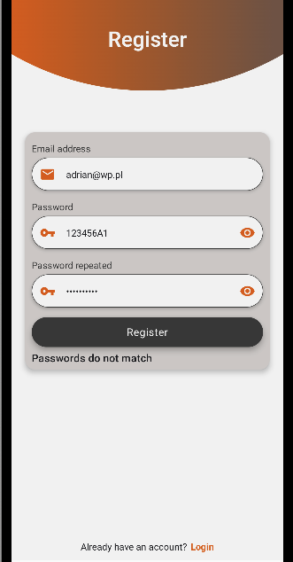
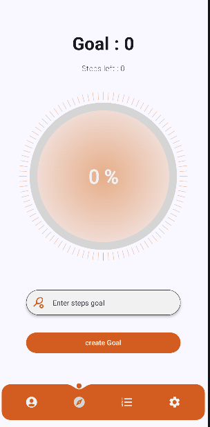

Stepogotchi: Step Counter with a Twist!
Stepogotchi is not your typical step counter. This app motivates you to stay active by turning your daily step goals into an engaging experience! As you complete step goals, you earn experience points (EXP) to feed and evolve your very own monster, similar to the classic Tamagotchi. Watch your monster grow and evolve into higher forms as you become more active!

Key Features:
Step Goals and EXP: Achieve your daily step goals and earn EXP to take care of your pet monster. The more you walk, the stronger and happier your monster becomes.
Evolution System: Your monster evolves as you continue to meet your fitness goals, encouraging consistent activity.

Clean Architecture: The project follows clean architecture principles, focusing on maintainability and scalability.
MVVM and Use Cases: The app is built using the MVVM architecture, with clearly defined use cases for business logic.
Data Validation and Unit Testing: Validating user input and step data with extensive unit tests ensures reliability and accuracy.
Dependency Injection (Hilt): Efficient dependency management using Hilt for better modularity.
Data Storage:
MongoDB (Realm DB): Used for saving user data and monster progress.
SharedPreferences: For simple data storage needs.
Jetpack Compose: A modern declarative UI framework for a smooth and responsive user interface.

User Authentication:
Firebase Authentication: Users can create a profile and log in using Firebase, ensuring secure and seamless account management.

Future Network Features:
Additional network functionalities, such as online competitions and social features, are currently in development.

